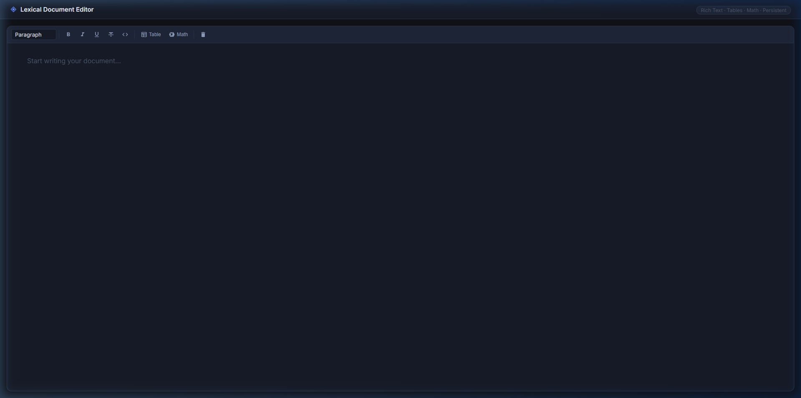

# Lexical Rich Text Editor

A React-based rich text editor built using the Lexical framework, fulfilling the requirements for the full-stack hiring challenge.



## Features

- **Built with Lexical:** Modern, extensible editor architecture utilizing Lexical's React bindings.
- **Rich Text Formatting:** Bold, Italic, Underline, Strikethrough, and Code block support.
- **Table Support:** Insert, edit, and layout functional data tables directly within the editor.
- **Mathematical Expressions:** Uses KaTeX to render LaTeX expressions either inline or as block equations. Formulas are fully editable via a custom modal interface.
- **State Management:** Editor UI state (Toolbar, modals) and persistence logics are managed via robust **Zustand** stores, ensuring UI state remains cleanly decoupled from the Editor DOM.
- **Persistence:** Automatically saves editor content into `localStorage` (simulated API), persisting your text across reloads. 

## Project Architecture & Design Decisions

- **Modularity:** 
  - **`src/editor/`**: Centralizes all Lexical configurations, core plugins, and custom node definitions mapping out the editor experience. 
  - **`src/components/`**: Houses all external React UI elements (Toolbar, Modals). UI logic and Editor state are kept strictly separated. UI uses `useLexicalComposerContext` to dispatch Lexical Commands without deeply entangling rendering behaviors.
  - **`src/store/`**: Using **Zustand** v5 for app-wide state limits unnecessary deeply nested prop-drilling, and effectively mitigates React `getSnapshot` infinite re-render loops by leveraging `useShallow`.

- **Extensibility:** The mathematical equation parser (`MathNode.tsx` & `MathPlugin.tsx`) relies on standard Lexical Decorator Nodes—an approach easily replicable for embedding Video nodes, Image nodes, or any future complex widgets.

## Installation and Setup

### Prerequisites
- Node.js (v18 or higher recommended)
- npm or yarn

### 1. Clone the repository
```bash
git clone https://github.com/INFINITYv69/fullstackhiringchallenge.git
cd fullstackhiringchallenge
```

### 2. Install dependencies
```bash
npm install
```

### 3. Start the development server
```bash
npm run dev
```
The application will be available at `http://localhost:5173`.

### 4. Build for Production
To output the final, optimized bundle into the `dist/` directory, run:
```bash
npm run build
```
