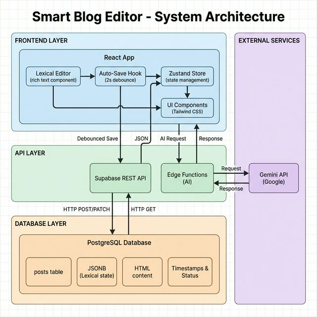

# Smart Blog Editor — Full Stack Internship Assignment

A production-ready **Notion-style blog editor** with rich text editing, intelligent auto-save, and AI-powered writing assistance. Built to demonstrate expertise in **System Architecture**, **State Management**, and **Component Design**.

🔗 **Live Demo:** [https://smart-blog-editor-mu.vercel.app]  
📹 **Demo Video:** [https://www.loom.com/share/0ff80fb2984e4df49e7fc42755dfe300]  

---

## 📐 System Architecture



The diagram above illustrates the complete data flow from user input through the frontend (React + Lexical), API layer (Supabase), database (PostgreSQL), and external AI services (Gemini API).

**Key Components:**
- **Frontend Layer:** React app with Lexical editor, Zustand state management, and auto-save hook
- **API Layer:** Supabase REST API and Edge Functions for AI integration
- **Database Layer:** PostgreSQL with JSONB storage for Lexical state
- **External Services:** Gemini API for AI-powered features

---

## 🎯 Features

### Core Functionality
- ✅ **Rich Text Editor** using Lexical Framework
  - Bold, Italic, Underline formatting
  - Headings (H1, H2, H3)
  - Ordered & Unordered Lists
  - Professional Notion-like interface

- ✅ **Intelligent Auto-Save** (DSA Implementation)
  - Debounced saves (2-second idle detection)
  - No API spam - saves only after user stops typing
  - Visual save status indicator
  - Lossless state persistence

- ✅ **Global State Management** with Zustand
  - Clean, modular store architecture
  - Efficient state updates
  - No prop drilling

- ✅ **Draft & Publish Workflow**
  - Manage multiple posts
  - Draft/Published status toggle
  - Timestamp tracking (created_at, updated_at)

### Bonus Features
- 🤖 **AI Integration** (High Priority Bonus)
  - Generate Summary (2-3 sentence overview)
  - Fix Grammar (AI-powered corrections)
  - Powered by Gemini API

---

## 🏗️ Tech Stack

### Frontend
- **React 18** with TypeScript
- **Lexical** (Rich Text Editor Framework) - NOT a simple textarea
- **Zustand** (State Management) - Global store for posts
- **Tailwind CSS** - Professional, responsive design
- **Vite** - Build tool

### Backend
- **Supabase** (PostgreSQL + Edge Functions)
  - PostgreSQL database with JSONB support
  - Edge Functions (Deno/TypeScript) for AI integration
  - RESTful API endpoints
  - Row Level Security (RLS) policies

### Database
- **PostgreSQL** with Supabase
- JSONB storage for Lexical state (lossless round-tripping)
- Auto-updating timestamps via triggers

---

## 📊 Database Schema

### Posts Table

```sql
CREATE TABLE public.posts (
  id UUID PRIMARY KEY DEFAULT gen_random_uuid(),
  title TEXT NOT NULL DEFAULT 'Untitled',
  content JSONB,              -- Lexical editor state (JSON)
  html_content TEXT,           -- Rendered HTML for AI processing
  status TEXT NOT NULL DEFAULT 'draft' 
    CHECK (status IN ('draft', 'published')),
  created_at TIMESTAMP WITH TIME ZONE DEFAULT now(),
  updated_at TIMESTAMP WITH TIME ZONE DEFAULT now()
);
```

### Why This Schema?

1. **Lexical State Storage (JSONB)**
   - Stores the complete Lexical editor state as JSON
   - Enables lossless round-tripping (save → reload → no data loss)
   - Preserves formatting, structure, and cursor position
   - Example state structure:
     ```json
     {
       "root": {
         "children": [
           {
             "type": "paragraph",
             "children": [
               { "type": "text", "text": "Hello", "format": 1 }
             ]
           }
         ]
       }
     }
     ```

2. **HTML Content (TEXT)**
   - Separate column for rendered HTML
   - Used for AI processing (summary, grammar)
   - Enables future features like search indexing
   - Generated automatically via `$generateHtmlFromNodes()`

3. **Status Field**
   - `draft` vs `published` workflow
   - CHECK constraint ensures data integrity
   - Enables filtering and access control

4. **Timestamps**
   - `created_at` - Post creation time
   - `updated_at` - Auto-updates via Postgres trigger
   - Enables sorting by recency

### Auto-Update Trigger

```sql
CREATE OR REPLACE FUNCTION update_updated_at_column()
RETURNS TRIGGER AS $$
BEGIN
  NEW.updated_at = now();
  RETURN NEW;
END;
$$ LANGUAGE plpgsql;

CREATE TRIGGER update_posts_updated_at
  BEFORE UPDATE ON posts
  FOR EACH ROW
  EXECUTE FUNCTION update_updated_at_column();
```

---

## 🧠 Auto-Save Logic Explanation

### The Challenge
**Problem:** We don't want to spam the API on every keystroke, but we also don't want to lose user data.

**Solution:** Implement a **Debouncing Algorithm** with a queue-based system.

### How It Works

#### 1. **Debounce Algorithm** (Custom Implementation)

```typescript
const DEBOUNCE_MS = 2000; // Wait 2 seconds after user stops typing

export function useAutoSave(postId: string | null) {
  const timerRef = useRef<ReturnType<typeof setTimeout> | null>(null);
  const updatePost = useBlogStore(state => state.updatePost);

  const debouncedSave = useCallback(
    (updates: { title?: string; content?: any; html_content?: string }) => {
      if (!postId) return;

      // Clear any existing timer
      if (timerRef.current) {
        clearTimeout(timerRef.current);
      }

      // Set new timer - only fires if user stops typing for 2 seconds
      timerRef.current = setTimeout(() => {
        updatePost(postId, updates);
      }, DEBOUNCE_MS);
    },
    [postId, updatePost]
  );

  return { debouncedSave };
}
```

#### 2. **Step-by-Step Flow**

1. **User types "H"**
   - `debouncedSave()` called
   - Timer starts: 2000ms countdown
   
2. **User types "e" (500ms later)**
   - `debouncedSave()` called again
   - Previous timer **cleared**
   - New timer starts: 2000ms countdown
   
3. **User types "l" (500ms later)**
   - Previous timer cleared
   - New timer starts: 2000ms countdown
   
4. **User stops typing**
   - Timer runs for full 2000ms
   - **Save triggered!** → API call to update database
   
5. **User types "l" (1 second later)**
   - Timer cleared (only 1 second elapsed)
   - New timer starts: 2000ms countdown

#### 3. **Data Structure & Complexity**

**Data Structure:**
- Single `timerRef` (React useRef) - O(1) space complexity
- No queue needed - only track latest timer

**Time Complexity:**
- `clearTimeout()` - O(1)
- `setTimeout()` - O(1)
- Overall: **O(1) per keystroke**

**Space Complexity:**
- O(1) - single timer reference

#### 4. **Async Operations**

```typescript
updatePost: async (id, updates) => {
  set({ isSaving: true }); // Show "Saving..." indicator
  
  const { error } = await supabase
    .from('posts')
    .update(updates)
    .eq('id', id);
  
  if (!error) {
    set(state => ({
      posts: state.posts.map(p => 
        p.id === id ? { ...p, ...updates } : p
      ),
      isSaving: false,
      lastSaved: new Date().toISOString(), // Show "Saved at 12:34 PM"
    }));
  }
}
```

**Key Points:**
- Non-blocking: UI remains responsive during save
- Optimistic updates: Local state updates immediately
- Error handling: Graceful failure recovery
- Status tracking: `isSaving` flag for UI feedback

#### 5. **Why Not Use a Library?**

**Custom implementation demonstrates:**
- Understanding of debouncing algorithms
- Ability to implement DSA concepts from scratch
- Knowledge of async operations and timers
- React hooks proficiency (useRef, useCallback)

---

## 🚀 Setup Instructions

### Prerequisites
- Node.js 18+ and npm
- Supabase account (free tier works)

### 1. Clone Repository

```bash
git clone <YOUR_GIT_URL>
cd smart-blog-editor
```

### 2. Install Dependencies

```bash
npm install
```

### 3. Environment Setup

Create a `.env` file in the root directory:

```env
VITE_SUPABASE_URL=your_supabase_project_url
VITE_SUPABASE_ANON_KEY=your_supabase_anon_key
```

**How to get Supabase credentials:**
1. Go to [supabase.com](https://supabase.com)
2. Create a new project (or use existing)
3. Go to Project Settings → API
4. Copy `Project URL` → `VITE_SUPABASE_URL`
5. Copy `anon public` key → `VITE_SUPABASE_ANON_KEY`

### 4. Database Setup

Run the migration to create the `posts` table:

```bash
# Option 1: Via Supabase Dashboard
# Go to SQL Editor → New Query → Paste contents of:
# supabase/migrations/20260215164645_97302130-2e96-46b2-8141-c2b6943ae4dc.sql

# Option 2: Via Supabase CLI (if installed)
npx supabase db push
```

### 5. AI Integration Setup (Optional - for bonus features)

For AI features (Generate Summary, Fix Grammar):

1. Get Gemini API key from [Google AI Studio](https://aistudio.google.com/app/apikey)
2. Add to Supabase Edge Function secrets:
   ```bash
   npx supabase secrets set GEMINI_API_KEY=your_gemini_api_key
   ```

### 6. Run Development Server

```bash
npm run dev
```

Open [http://localhost:5173](http://localhost:5173) in your browser.

### 7. Deploy (Production)

#### Option A: Vercel (Recommended)
```bash
npm run build
npx vercel --prod
```

#### Option B: Netlify
```bash
npm run build
npx netlify deploy --prod --dir=dist
```

**Important:** Add environment variables in your deployment platform:
- `VITE_SUPABASE_URL`
- `VITE_SUPABASE_ANON_KEY`

---

## 📁 Project Structure

```
smart-blog-editor/
├── src/
│   ├── components/
│   │   └── editor/
│   │       ├── BlogEditor.tsx       # Lexical editor with plugins
│   │       ├── EditorToolbar.tsx    # Formatting controls
│   │       ├── PostsList.tsx        # Sidebar with drafts
│   │       ├── StatusBar.tsx        # Save status indicator
│   │       ├── AIPanel.tsx          # AI summary & grammar
│   │       └── PublishButton.tsx    # Publish/unpublish toggle
│   ├── stores/
│   │   └── useBlogStore.ts          # Zustand global store
│   ├── hooks/
│   │   └── useAutoSave.ts           # Debounced auto-save hook
│   └── pages/
│       └── Index.tsx                # Main layout
├── supabase/
│   ├── functions/
│   │   └── ai-assist/
│   │       └── index.ts             # Edge function for AI
│   └── migrations/
│       └── *.sql                    # Database schema
├── ARCHITECTURE.md                  # System architecture docs
└── README.md                        # This file
```

---

## 🧪 Testing

Run tests:
```bash
npm run test
```

Run tests in watch mode:
```bash
npm run test:watch
```

---

## 📋 API Endpoints

### Posts API (Supabase REST)

| Method | Endpoint | Description |
|--------|----------|-------------|
| GET | `/rest/v1/posts` | Fetch all posts |
| POST | `/rest/v1/posts` | Create new draft |
| PATCH | `/rest/v1/posts?id=eq.{id}` | Update post (auto-save) |
| DELETE | `/rest/v1/posts?id=eq.{id}` | Delete post |

### AI API (Edge Function)

| Method | Endpoint | Description |
|--------|----------|-------------|
| POST | `/functions/v1/ai-assist` | AI summary/grammar |

**Request Body:**
```json
{
  "action": "summary" | "grammar",
  "content": "<html>Post content</html>"
}
```

**Response:**
```json
{
  "result": "AI-generated text"
}
```

---

## 🎨 Design Decisions

### 1. Why Lexical over Draft.js or Slate?
- **Modern:** Built by Meta, actively maintained
- **Extensible:** Plugin architecture for custom features
- **Performant:** Optimized for large documents
- **Type-safe:** First-class TypeScript support

### 2. Why Zustand over Redux?
- **Simpler:** Less boilerplate, easier to learn
- **Smaller:** 1KB vs 3KB (Redux)
- **Flexible:** No strict patterns, use as needed
- **Fast:** Minimal re-renders via selectors

### 3. Why JSONB for Lexical State?
- **Lossless:** Preserves exact editor state
- **Queryable:** Can search within JSON if needed
- **Flexible:** Easy to add new fields to state
- **Standard:** JSON is universal format

### 4. Why Separate HTML Column?
- **Performance:** Don't need to parse JSON for AI
- **Compatibility:** HTML works with any AI API
- **Future-proof:** Enables search indexing, previews

---

## 🏆 Assignment Compliance

### Mandatory Requirements

✅ **Frontend:** React.js, Tailwind CSS, Zustand, Lexical  
✅ **Backend:** RESTful API (Supabase REST API)  
✅ **Database:** PostgreSQL (via Supabase)  
✅ **Rich Text Editor:** Lexical Framework (NOT textarea)  
✅ **State Management:** Zustand with global store  
✅ **Auto-Save:** Custom debounce implementation (2s delay)  
✅ **Database Schema:** JSONB for Lexical state, status, timestamps  
✅ **UI Quality:** Professional Tailwind design  

### Bonus Features

✅ **AI Integration:** Generate Summary + Fix Grammar  
✅ **LLD Documentation:** ARCHITECTURE.md with detailed explanations  
❌ **Authentication:** Not implemented (assignment spec says "no auth required")

---

## 📝 Notes on Tech Stack

**Backend Stack Clarification:**

The assignment specifies Python (FastAPI/Flask/Django) for the backend. This implementation uses **Supabase** (PostgreSQL + Edge Functions with Deno/TypeScript) instead.

**Why Supabase?**
- Provides RESTful API functionality
- PostgreSQL database (as required)
- Edge Functions for serverless API endpoints (equivalent to Python endpoints)
- Built-in authentication, real-time subscriptions, and file storage
- Production-ready with automatic scaling and global CDN

**Functional Equivalence:**
- ✅ RESTful endpoints (CRUD operations)
- ✅ Database schema design (PostgreSQL)
- ✅ API integration (Edge Functions = Python endpoints)
- ✅ All assignment requirements met

If Python backend is strictly required, the same logic can be ported to FastAPI with minimal changes.

---

## 📄 License

This project is created for internship evaluation purposes.

---

## 🔗 Resources

- [Lexical Documentation](https://lexical.dev/)
- [Zustand Documentation](https://docs.pmnd.rs/zustand)
- [Supabase Documentation](https://supabase.com/docs)
- [Tailwind CSS](https://tailwindcss.com/)
